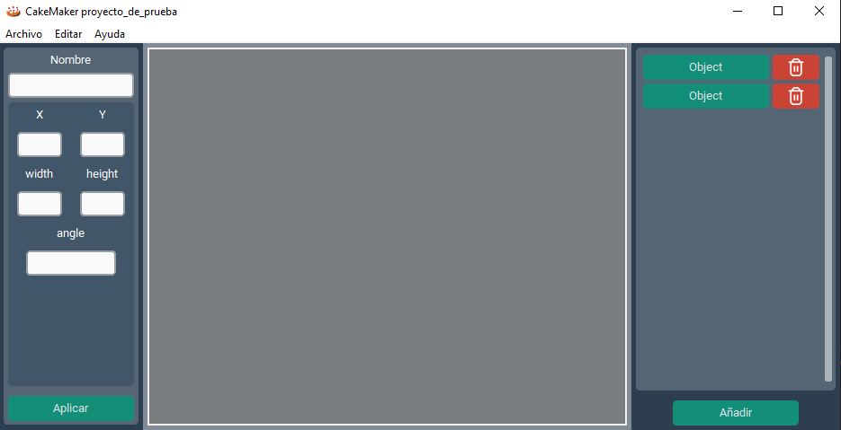

# CakeMaker. 
Es un Framework que trabaja junto con [OneLua](https://github.com/ONElua?tab=repositories) que permite
automatizar tareas de manera más rapida. Incluyendo funciones de animaciones, carga escenas mediante
archivos JSONs, detección de colisiones e implementando behaviors para facilitar la creación de tus proyectos.
[Documentación](docs/CakeMaker/index.md)

# CakeMakerEditor.
Un editor que permite modificar las propiedades de los archivos de escena con formato JSON, manejando
animaciones, sprites y tiles. Esta aplicación esta creada con las tecnologías python con el framework
CustomTkinter basada en Tkinter.
[Documentación](docs/CakeMakerEditor/index.md)

